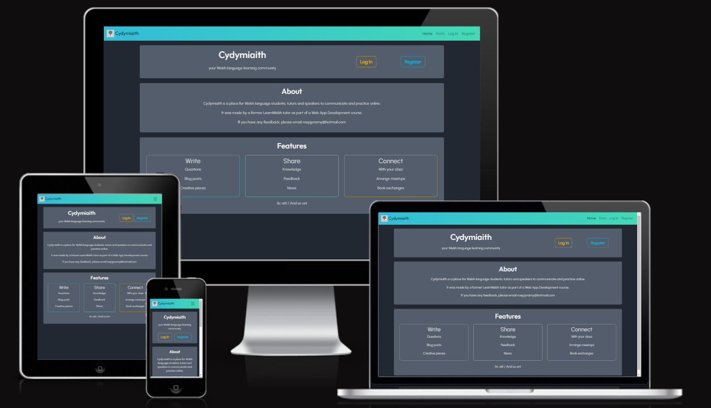
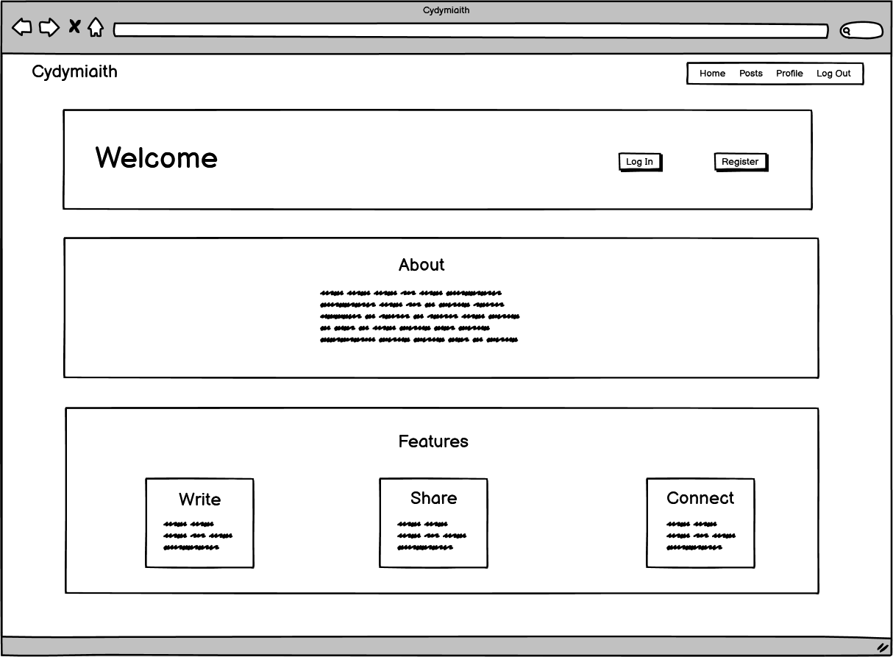
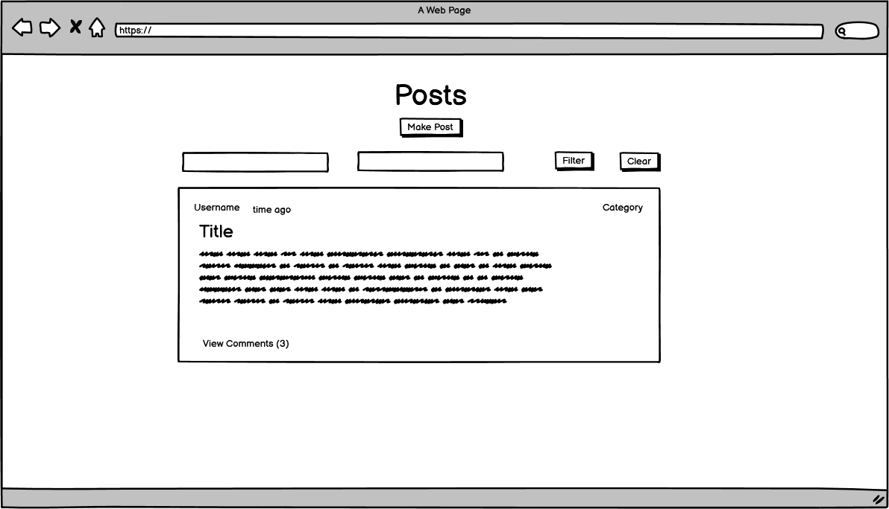
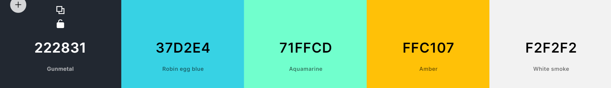

# Milestone 3 Project - Cydymiaith
By Gareth Llewelyn

[View website on deployed Heroku site](link!)



## Table of contents

> 1. [Overview](#overview)
> 2. [UX](#ux)
>> 1. [Strategy](#strategy)
>> 2. [Scope](#scope)
>> 3. [Structure](#structure)
>> 4. [Skeleton](#skeleton)
>> 5. [Surface](#surface)
> 3. [Features](#features)
>> 1. [Existing Features](#existing-features)
>> 2. [Future Feature Considerations](#future-feature-considerations)
> 4. [Technologies Used](#technologies-used)
> 5. [Testing](#testing)
> 6. [Deployment](#deployment)
> 7. [Credits](#credits)
> 8. [Acknowledgements](#acknowledgements)
> 8. [Disclaimer](#disclaimer)

## Overview

[Back to top](#milestone-3-project---cydymiaith)

Cydymiaith is a basic social network for Welsh language tutors and students to share information, practice and connect.

For the assessor - Originally, I had planned a questions and answers site. I later changed this to posts and comments for more category options such as 'diary entry'. This is why the backend code still refers to questions and answers. However, at the request of my mentor, I changed user-facing view names to refer to 'posts' and 'comments' for the sake of UX. Also, the Group weekday field is a string in order to account for variation such as multiple days and also times if needed to differentiate between similar classes on the same day.

## UX

[Back to top](#milestone-3-project---cydymiaith)

### Strategy

[Back to top](#milestone-3-project---cydymiaith)

This was inspired by my year as a Welsh language tutor for adult learners with learnwelsh.cymru. Rather than tutors communicating with students in an isolated manner via Whatsapp, I thought that a centralized platform would be more effective, more engaging and foster a greater sense of community.

Creator's goals...

- to create a platform for tutors and students to connect
- to provide a sense of community for learners
- to provide a means for learners to practice, find inspiration and learn from others
- to allow tutors to disseminate information more quickly and to allow students better visibility of news etc.

Student's goals...

- to be able to communicate with class and tutor
- to have a place to practice reading and writing Welsh and have the opportunity to get feedback/corrections
- to be able to obtain answers from a larger base of expertise
- to connect with other speakers and learners

#### User Stories (US) and Acceptance Criteria (AC)

US1 - "As a visitor to the website, I want to know what the website does, so that I can decide if it would be useful to me'.

US2 - "As a potential user, I want the interface to be intuitive and easy to use."

US3 - "As an unregistered user, I want to be able to view content on the site to get a sense of what I could gain from registering".

US4 - "As an unregistered user, I want to be able to register an account to which I can log in and enjoy all the features available."

US5 - "As a logged in user, I want to be able to make, edit and delete my own posts as well as my answers/comments on the posts of others.

US6 - "As a mobile user, I want to be able to interact with the site with the same degree of functionality via a responsive design."


US1 - "As a Welsh language tutor, I want to be able to communicate with my class."

AC1 - "Tutors and students can post messages that are class-specific and get responses that relate to specific posts."

US2 - "As a tutor, I want my students and myself to benefit from what other tutors and students post to the whole community and have access to a wider base of expertise".

AC2 - "Tutors and students can view posts made by other tutors and students from across Wales and beyond".

US3 - "As a tutor, I want other tutors to be able to help with answering the questions of my students and with providing feedback on their writing, and vice versa."

AC3 - "Tutors can add answers to posts made by students that aren't their own."

US4 - "As a student, I want a community to practice my Welsh and connect with others". 

AC4 - "Students can write/read posts of a variety of types, such as blog posts, diary entries, creative writing and get/give feedback on them."

US5 - "As a user, I want to be able to register and log in and out securely."

AC5 - "Users can create an account and log in and be sure that others can't see information or use functionality that is solely for them."

### Scope

[Back to top](#milestone-3-project---cydymiaith)

#### Functional Requirements

- Simple and intuitive interface
- Allow users to register, view, edit and delete a profile and log in/out
- Allow unregistered users to read posts and comments
- Allow registered users to create/update/delete posts and comments
- Allow functionality based on role (Student, Tutor or Admin) and login status
- Allow Tutor to create groups and add/remove students
- Allow Admin to read, update and delete everything
- Allow Admin to set the roles of other users
- Allow visibility of content based on login status, group, filters
- Email confirmation for registration and forgot/reset password functionality

#### Content requirements

- The main content of the site will be made by registered site members and will have full CRUD functionality.

##### Profiles

This model contains the following data: username, password hash, bio, level, provider, location, role and email.

Email, username and password hash are set at profile creation. The user can set their level, provider, location and bio on their profile.

##### Posts

This model contains the following data: username, category, group_id, title, description, answer_count

Users set the title, description, category and group_id. The username and answer_count are automatically collected. The group_id allows filtering by group and answer count allows the number of comments to be displayed.

##### Comments

This model contains the following data: username, question_id, text.

The user writes the text.

##### Groups

This model contains the following data: tutor, level, provider, year, weekday, and students, which is an array of usernames.

Tutors and Admins can create groups, and set provider, level, year and weekday. Students can be added by going to the Users page and adding users to one of their own groups. Students can be removed from a group by finding the group on the Groups page, opening the Student List and removing the appropriate student.

### Structure

[Back to top](#milestone-3-project---cydymiaith)

For unregistered/logged out users, the site navbar will contain the following links: Home, Posts, Log In, Register.

For logged in Students, the site navbar will contain the following links: Home, Posts, Profile, Log Out.

For logged in Tutors and Admins, the site navbar will contain the following links: Home, Posts, Profile, Users, Groups, Log Out.

The information of Profiles, Posts, Comments, Users and Groups will be displayed as cards.

### Skeleton

[Back to top](#milestone-3-project---cydymiaith)

Home Page Wireframe



Posts Page Wireframe



### Surface

[Back to top](#milestone-3-project---cydymiaith)

#### Favicon and Logo

I asked GPT-4 to create some logo options for me, and I picked the final choice. I then used a favicon converter to generate the favicon images and link tags.


#### Colour Palette

Here is the colour palette I used.



Since the site is text based, I opted for a dark theme to make reading easier on the eyes.

#### Fonts

The fonts used are from Google fonts. The brand name and titles use Outfit, and the rest is Urbanist.

## Features

[Back to top](#milestone-3-project---cydymiaith)

### Existing Features

[Back to top](#milestone-3-project---cydymiaith)

#### Account Creation and Use

##### Registration

- The initial registration page prompts the user for an email to be verified.
- The email must be unique and not already exist in the database.
- An email is then sent to that address, and when the link therein is clicked, the user is taken to the main registration page.
- The main registration form asks for a username and password.
- The username must be unique and not already exist in the database.
- The password is required to be in a certain form and contain certain characters. 
- If the user wants to change their password, they are able to reset it via email confirmation.
- Form validation will inform the user of any errors in user input.
- Flash messages will inform the user if the email or username are already taken.
- Entering a unique email, username and valid password will successfully register the user, who will be redirected to their profile.
- A flash message will display informing the user that registration was successful.

##### Log In

- The Log In form requests the user's username and password. 
- The form validation requires that the email be in a certain format.
- The form validation requires that the password has a certain format.
- If the entered username or password do not correspond to a user in the database, a flash message will display to the user.
- Entering a username and password that successfully correspond to a user's details in the database will log the user in to that profile.
- A flash message will inform the user that login was successful.
- If the user has forgotten their password, they are able to reset it via email confirmation.

##### Log Out

- A logged in user can click on the Log Out navbar option and the user will be redirected to the Log In page.
- A flash message will inform the user that logout was successful.

#### Role Management

##### Student Powers

- Create, view, edit and delete their own posts.
- Add, view, edit and delete their own comments on posts.
- Assign and filter posts by category or assigned group.
- Edit and delete their own profile.
- Reset password with email confirmation.

##### Tutor Powers

Include Student powers plus the following...

- Create, view, edit and delete own Groups.
- View a list of Users. Add Students from the Users list to own Groups.
- Remove Students from own Groups.
- Filter Posts by own Groups.
- Filter Users by level, provider, username, email and location.

##### Admin Powers

Include Tutor powers plus the following...

- View, edit, and delete all Groups.
- Edit and delete any Profile.
- Filter posts by any existing Group.
- Set users' role (Student/Tutor/Admin)

#### Posts

- Display username, amount of time since posted, the category of the post and the number of comments on the post. 
- Flash message will display when post successfully created, updated and deleted.
- If the post was made by the user, Edit and Delete links will be visible. 
- Clicking the delete link will bring up a modal asking for confirmation.

#### Comments

- Comments can be viewed and added on the same page.
- Flash messages inform the user if comments created, edited and deleted successfully.
- Adding and deleting comments will change the question's comment count.

#### Profiles

- Display user info and posts.

### Future Feature Considerations

[Back to top](#milestone-3-project---cydymiaith)

Bilingual - To be officially adopted by the LearnWelsh organization, the site would have to be bilingual.

User map - A map of the locations of registered users.

Word of the day

Friends - The ability to add friends and filter posts by friends list.

Close thread - The ability to set a post as closed, having been answered or becoming out of date.

## Technologies Used

[Back to top](#milestone-3-project---cydymiaith)

- Visual Studio Code as development environment
- Windows PowerShell terminal
- Git for version control
- GitHub as a code repository
- HTML5
- CSS3
- Bootstrap frontend framework
- Python
- Flask Web Application Microframework
- Jinja2 templating language for HTML generation
- Flask-Login for user session management
- Flask-Pymongo
- Flask-Mail for sending password reset confirmation emails
- Pymongo for interacting with MongoDB via Python
- MongoDB database
- Heroku for hosting
- GPT-4 for debugging, information gathering, writing docstrings, logo generation
- [favicon.io](https://favicon.io/) - Logo to favicon converter
- [https://validator.w3.org/](https://validator.w3.org/) - HTML validator
- [https://jigsaw.w3.org/css-validator/](https://jigsaw.w3.org/css-validator/) - CSS validator
- [https://jshint.com/](https://jshint.com/) - JS validator
- [https://wave.webaim.org/](https://wave.webaim.org/) - 
- [https://webaim.org/resources/contrastchecker/](https://webaim.org/resources/contrastchecker/) - WAVE contrast checker

## Testing

[Back to top](#milestone-3-project---cydymiaith)

For the testing procedures and results, please see [TESTING.md](TESTING.md)

## Deployment

[Back to top](#milestone-3-project---cydymiaith)

### Deployment to Heroku

1. Set up database and collection with MongoDB.
2. Add a Procfile and requirements.txt file to the project.
3. Navigate to Heroku and log in or register for an account.
4. Click 'New' => 'Create new app'. Enter App Name that's unique, and the Region. Click 'Create app'.
5. In the app's 'Deploy' tab, click on 'GitHub' in preparation for setting up automatic deployment from the GitHub repository. Enter GitHub username and repo name and 'Search'. Click 'Connect' once found.
6. In the app's 'Settings' tab. Click 'Reveal Config Vars' and set environment variables as outlined in the 'Config Vars' section below.
7. Back in the app's 'Deploy' tab, click 'Enable Automatic Deploys'.
8. Choose the appropriate branch to deploy (in my case 'main') and click 'Deploy Branch'.

### Config Vars

Heroku requires the following environment variables in order for the deployed site to function properly. Under Config Vars, select 'Reveal Config Vars' and add the following:

| KEY | VALUE |
| --- | --- |
| IP | 0.0.0.0 |
| PORT | 5000 |
| MONGO_URI | your own value, see below |
| MONGO_DBNAME | your own value |
| SECRET_KEY | your own value |
| MAIL_SERVER | your own value |
| MAIL_PORT | 587 |
| MAIL_USE_TLS | true |
| MAIL_USERNAME | your own value |
| MAIL_PASSWORD | your own value |
| MAIL_DEFAULT_SENDER | your own value |

The MONGO_URI value can be obtained from MongoDB via the following steps:
  - Log in to MongoDB.
  - Under the 'Data Services' tab, choose the desired cluster and click 'Connect'.
  - Click 'Connect Your Application'.
  - Copy the connection string and replace password with your own password, removing the angle brackets.

### Local Deployment

This project can be forked or cloned to your own local system.

You will need to install any packages necessary for the app, listed in the requirements.txt file.

`pip3 install -r requirements.txt`

You will also need to create an 'env.py' file at root level that will note the 'config vars' above as environment variables. Here is a template:

```
import os

os.environ.setdefault("IP", "0.0.0.0")
os.environ.setdefault("PORT", "5000")
os.environ.setdefault("SECRET_KEY", "your own value")
os.environ.setdefault("MONGO_URI", "your own value")
os.environ.setdefault("MONGO_DBNAME", "your own value")
os.environ.setdefault("MAIL_SERVER", "your own value")
os.environ.setdefault("MAIL_PORT", "587")
os.environ.setdefault("MAIL_USE_TLS", "true")
os.environ.setdefault("MAIL_USERNAME", "your own value")
os.environ.setdefault("MAIL_PASSWORD", "your own value")
os.environ.setdefault("MAIL_DEFAULT_SENDER", "your own value")

```

## Credits

[Back to top](#milestone-3-project---cydymiaith)

### Code

#### YouTube

- [How to Generate App Passwords in Google | Fix App Passwords option not found](https://www.youtube.com/watch?v=MkLX85XU5rU) - Harish Bhathee

- [Python Flask Tutorial: Full-Featured Web App Part 12 - Custom Error Pages](https://www.youtube.com/watch?v=uVNfQDohYNI) - Corey Schafer

#### GPT-4

- Wrote the first draft of the docstrings which I edited.
- Helped me set up Flask-Mail.

#### My mentor Ben Kavanagh

- How to set up Jinja variables for dynamic navbar link highlighting

### Media

Logo - Created by GPTo

## Acknowledgements

[Back to top](#milestone-3-project---cydymiaith)

I'd like to thank Ben Kavanagh, my mentor and coding goals personified, for his guidance with this project.

## Disclaimer

[Back to top](#milestone-3-project---cydymiaith)

This website is currently for educational purposes only.