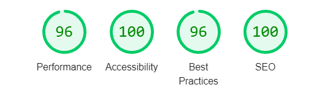

# Cydymiaith Testing Documentation

Go to [README.md](README.md)

## Table of contents

> 1. [User Stories Testing](#user-stories-testing)
> 2. [Feature Testing](#feature-testing)
> 3. [Defensive Programming Testing](#defensive-programming-testing)
> 4. [Responsiveness Testing](#responsiveness-testing)
> 5. [Browser Testing](#browser-testing)
> 6. [Automated Testing](#automated-testing)
> 7. [Bugs](#bugs)

## User Stories Testing

[Back to top](#cydymiaith-testing-documentation)

US1 - "As a visitor to the website, I want to know what the website does, so that I can decide if it would be useful to me'.

AC1 - "A user must be able to identify the website's name and understand its purpose on the first visit."

1. Navigate to the website in the Chrome browser.
2. Check that the site name (Cydymiaith) and navbar are clearly visible.
3) (As a logged out user) check that the header is clearly visible on the Home page, and that it displays the site name and descriptive tag ('your Welsh language learning community').
4) Check that the About section is visible.
5) Check that the Features section is visible.

Test result: Pass

US2 - "As a potential user, I want the interface to be intuitive and easy to use."

AC2 - "A user should be able to understand how to navigate and interact with the website.

1) The Home page contains both brief and longer descriptions of the site's purpose.
2) The navbar links are tested in the [navigation section](#navigation) below.
3) The Home page header contains clear calls to action, depending on logged in status.
4) Clickable links and options are distinctly highlighted.
5) Deletion modals allow the user to confirm their intention to delete an item.
6) Flash messages provide confirmation or feedback to users in response to their actions.
7) The user will be redirected to the most appropriate page as a result of their actions.
8) The view of the site that users have will reflect their level of authorization.

Test result: Pass

US3 - "As an unregistered user, I want to be able to view content on the site to get a sense of what I could gain from registering".

AC3 - "An unregistered user should be able to see all posts and their comments.

1) Unauthenticated users can navigate to the Posts page and view/filter all posts.
2) Unauthenticated users can view comments on any post.

Test result: Pass

US4 - "As an unregistered user, I want to be able to register an account to which I can log in and enjoy all the features available."

AC4 - "An unregistered user should be able to register an account and log in/out.

1) An unregistered user can navigate to the Register page, and be prompted to enter an email.
2) The user will then be sent an email containing a link to the main registration page.
3) The user can then submit a unique username and password to create an account and be logged in.
4) A user can log out.
5) A user can log in.
6) A user can reset password if it's been forgotten.

Test result: Pass

US5 - "As a logged in user, I want to be able to make, edit and delete my own posts as well as my comments on the posts of others.

AC5 - "A logged in user should be able to be able to make, edit and delete their own posts, as well as make, edit and delete their comments on any post.

1) A logged in user is able to navigate to the Posts page and click 'Make Post'.
2) The user is then able to fill out the post form and submit.
3) On the user's own post, the options to 'Edit' and 'Delete' will be displayed. The user can edit and delete the post through these.
4) The user can click 'View Comments on any post and add a comment via the form beneath the post.
5) On the users, own comments, the options 'Edit' and 'Delete' will be visible. The user can edit and delete the comment via these links.

Test result: Pass

US6 - "As a mobile user, I want to be able to interact with the site with the same degree of functionality via a responsive design."

AC6 - "A user should be able to use the site on mobile devices.

The testing for responsive design can be seen in the [Responsiveness Testing](#responsiveness-testing) section.

Test result: Pass

US7 - "As a Welsh language tutor, I want to be able to communicate with my class."

AC7 - "Tutors and students can post messages that are class-specific and get responses that relate to specific posts."

1) Tutors are able to create a group and add registered students to the group from the Users page.
2) Tutors and students can then create a post and choose to assign the post to 'All' or a group they own (tutor) or belong to (student) from the dropdown.
3) Tutors and students of the group can then filter posts by that group.

Test result: Pass

US8 - "As a tutor, I want my students and myself to benefit from what other tutors and students post to the whole community and have access to a wider base of expertise".

AC8 - "Tutors and students can view posts made by other tutors and students from across Wales and beyond".

1) All posts made by any user will appear in the posts feed.
2) Any registered user can comment on anyone else's post.

Test result: Pass

US9 - "As a student, I want a community to practice my Welsh and connect with others". 

AC9 - "Students can write/read posts of a variety of types, such as blog posts, diary entries, creative writing and get/give feedback on them."

1) The testing for post creation can be seen in the [Post creation](#post-creation) and [Comment creation](#comment-creation) sections below.

Test result: Pass

## Feature Testing

[Back to top](#cydymiaith-testing-documentation)

Please note that these tests flow sequentially.

### Unregistered Users

#### Navigation

1) Navigate to Cydymiaith in the Chrome browser.
2) From the Home page, click on the Posts navbar item.
3) On the Posts page, click 'Log In To Make Post' button. The user should be redirected to the Log In page.
4) On the Log In page, click 'Register here'. The user should be sent to the Confirm Email to Register page.
5) Click 'Log In' from the navbar. The user should navigate to the Log In page.
6) Click 'Register' from the navbar. The user should navigate to the Register page.

Test result: Pass

#### Visibility

1) The navbar should contain the following links - Home, Posts, Log In, Register.
2) Navigate back to the Posts page. Check that only one filter selector (category) is visible. 
3) On the posts that are displayed, there should be no links to 'edit' or 'delete' posts.
4) Look for a post with at least one comment. Click the comments link. The user should be directed to a page that shows the comments on the post.
5) Check that on the comment(s), there are no links for 'Edit' or 'Delete'.
6) Try to add a comment. The user should be redirected to the Log In page, and a flash message should appear saying 'Please log in to access this page.'

Test result: Pass

### Student Role

Feature abilities and limitations are dependent on the user's role. I will start with the Student role.

#### Registration 

1) Navigate to Cydymiaith in the Chrome browser, and click on the 'Register' navbar option.
2) On the Confirm Email to Register page, enter an email address you have access to. Click 'Send'.
3) Look for the confirmation email in your inbox and click the provided link. Check that the user is taken to the Register page.
4)  For the following form fields, enter these details.
  - Username: 'testuser1'
  - Password: 'testuser1'
5) If the values pass form validation (tested in the 'Defensive Programming Testing' section below), then upon clicking 'Register' the user should be redirected to the user's new profile page, that displays the username, 'Role: Student' and a flash message - "Registration Successful!".
6) The navbar menu items should have changed to 'Home, Posts, Profile, Log Out'.

Test result: Pass

#### Log Out

1) Having registered an account, click the 'Log Out' navbar option.
2) The user should be redirected to the Log In page, with a flash message saying 'Logged Out'.
3) The navbar menu items should be 'Home, Posts, Log In, Register'.

Test result: Pass

#### Log In

1) Having logged out and on the Log In page, enter username (testuser1) and password (testuser1).
2) The user should be redirected to the user's profile page, with a flash message saying "Croeso, testuser1".

Test result: Pass

#### Forgot Password

1) Having logged out, at the bottom of the Log In page, click 'Reset here' beneath 'Forgotten password?'. The user should be taken to the Confirm Email to Reset Password page.
2) Enter your email. Having clicked the button to confirm, a flash message should display "A confirmation email has been sent."
3) In your inbox, click on the link in the email titled "Password Reset Request". The user should be taken to the Reset Password page.
4) Enter a new password (testuser1). Click 'Reset Password'. The user should be taken to the Log In page and a flash message should display "Your password has been reset".
5) Log back in with the new password. The user should be logged in successfully.

Test result: Pass

#### Post Creation

1) Having logged in, navigate to Posts. Beneath the Posts title, the button should say 'Make Post'.
2) Click 'Make Post'. The user should be redirected to the Make Post page.
3) Fill in form details such as:
- Category: Question
- All/Group: All
- Title: "Student functionality test"
- Description: "testing"
4) Press the Submit button. The user should be redirected to the Posts page, with a flash message saying "Post Published".
5) Check that:
- The most recent post at the top matches the above details. 
- The post should note how long ago the post was made when page was loaded.
- The post should have 0 Comments. 
- Unlike other posts, there should be 'Edit' and 'Delete' links visible for the created post.

Test result: Pass

#### Post Updating

1) On the created post ('Student functionality test'), click 'Edit'. The user should be redirected to the Edit Post page.
2) Check that the input fields display the current values:
- Category: Question
- For All or Group?: All
- Title: "Student functionality test"
- Description: "testing"
3) Change the values to the following and press 'Submit':
- Category: Diary Entry
- For All or Group?: All
- Title: "Student post edit test"
- Description: "edit testing"
4) The user should be redirected to the Posts page and there should be a flash message saying "Post Updated"
5) Check that the edited post displays the updated details.

Test result: Pass

#### Post Deletion

1) On the above post titled "Student post edit test", click 'Delete'. A modal should appear asking to either 'Cancel' or 'Confirm'. 
2) Click 'Cancel'. The modal should disappear having made no change.
3) Click 'Delete' again, and then 'Confirm'. The post should be deleted, and a flash message should say 'Post Deleted'.

Test result: Pass

#### Post Filtering by Category

We will test group filtering later.

1) If there are not multiple posts visible on the Posts page already, create some more test posts with differing categories.
2) From the Category drop down menu, select the first menu item, and press 'Filter'. The page should reload and only display posts of that category or no posts. The Category filter should also display the selected category.
3) Repeat for all category menu items.
4) Having tested each category, click the 'Clear' button to reset the filter. Posts of every category should reappear.

Test result: Pass

#### Comment Creation

1) Create a post with the following details:
- Category: Other
- For All or Group?: All
- Title: "Comment CRUD testing"
- Description: "testing"
2) On the post, click the 'View Comments' link. The user should be directed to a page displaying the post with a comment box beneath.
3) In the comment box, type in "Comment creation test" and press 'Submit'. Check the following:
- The page should reload
- a flash message "Comment Added" should display
-  the new comment should be visible beneath the comment box and be right-aligned
- the post's Comments number should have updated from 'Comments (0)' to 'Comments (1)'

Test result: Pass

#### Comment Editing

1) On the comments page for the 'Comment CRUD testing' post, click on the 'Edit' link for the new comment. The user should be taken to a page with an 'Edit Comment' text box that's populated with the previous comment.
2) Edit the comment to 'Comment edit test'. Press 'Save Edit'.
3) Check that:
- The user is taken back to the comments page for the post
- A flash message reads 'Comment Edited'
- The comment text shows as 'Comment edit test'

Test result: Pass

#### Comment Deletion

1) On the comment, click the 'Delete' link. A modal should appear asking to 'Cancel' or 'Confirm'. 
2) Click 'Cancel'. The modal should disappear and nothing should have changed.
3) Click 'Delete' again, and then 'Confirm' on the modal.
4) Check the following:
- A flash message displays 'Comment Deleted'
- The number of comments should have changed to '0 Comments'
- The comment has been deleted

Test result: Pass

#### Profile Editing

1) Click the 'Profile' navbar option
2) On the profile, click 'Edit Profile'
3) First, just change the email to one that already exists (roepjynamy@hotmail.com), and click 'Save'. The user should be redirected to the Profile page and a flash message should display "That email is already in use".
4) Click 'Edit Profile' again and change the values to the following and press 'Save'
- Level: Blasu
- Provider: Caerdydd / Cardiff
- Location: Swansea
- Bio: "Hello world!"
5) Check that:
- the user is taken back to the profile page
- a flash message displays 'Profile Updated'
- the profile information has been updated
6) Click 'Edit Profile' again. On the Edit Profile page check that the input fields are populated with the current values.

Test result: Pass

#### Password Reset

1) On the Profile page, check that your email is set to the profile.
2) Click 'Reset Password'. A flash message should display "A confirmation email has been sent".
3) Find the email from cydymiaith@gmail.com in your inbox with the subject 'Password Reset Request'.
4) Open the email and click the link. The user should be taken to Cydymiaith's Reset Password page.
5) Enter the New Password, and click 'Reset Password'. The user should be sent back to the login page and a flash message should display "Your password has been reset".
6) Log back in with the new password. Log in should succeed.

Test result: Pass

#### Profile Deletion

This test is more involved as it requires a bit of set up to fully test the full deletion cascade of all the comments the user has made, the posts the user has made, and all comments associated with those posts.

Set up

1) As testuser1, add a comment ('testuser1 deletion cascade test') to testuser1's post titled 'Comment CRUD testing'.
2) Log Out and Register a new profile of username 'testuser2', password 'testuser2'. You will need to use a second email account that you have access to.
3) Create a post titled 'profile deletion cascade test'
4) Log Out and Log In as testuser1.
5) Find the post 'profile deletion cascade test' and add a comment.

Test

6) On testuser1's profile page, click 'Delete Profile'. A modal asking the user to 'Cancel' or 'Confirm' should appear.
7) Click 'Cancel'. The modal should disappear.
8) Click 'Delete Profile' again, and then 'Confirm'.
9) The user should be redirected to the Log In page and a flash message should display 'Account Deleted'.
10) Navigate to the Posts page. Check that:
- there are no posts by testuser1
- testuser1's comment on testuser2's post titled 'profile deletion cascade test' and check that there are no comments by testuser1.
11) Navigate to the Log In page and attempt to log in with testuser1's details. The page should refresh and flash a message 'Incorrect username and/or password'.

Test result: Pass

### Tutor Role

The Tutor role has all the abilities of the Student role plus more, which we will test below.

Using an Admin profile, I will set testuser2's role as 'Tutor' for the following tests. I will also create a new Student profile by registering an account using the following details:
- Email: (the first email address you used for testuser1)
- Username: testuser3
- Password: testuser3

#### Visibility

1) Log in as testuser2 and on the profile page, check that the role is set to 'Tutor'.
2) Check that the following navbar options are: Home, Posts, Profile, Users, Groups, Log Out
3) Navigate to the Users page. Check that at the bottom of each user card, only two links are visible: 'View Profile' and 'Add to Group'.

Test result: Pass

#### User Filtering

1) Set profile details for testuser2 in order to test the filters.
2) On the Users page, filter by Level. Only users of that level should be visible, or no users at all.
3) Repeat for each level.
4) Click 'Clear'. The filters should reset.
5) Repeat for Provider.
6) Filter users by testuser2's Username, Email and Location, clearing the filter between each one. The filters are currently case sensitive.
7) The filter fields should remember filter settings. 

Test result: Pass

#### Group Creation

1) Navigate to the Groups page. There should be no groups currently visible.
2) Click 'Add Group'. The user should be taken to the Add Group page.
3) Fill the form using the following details:
- Provider: Y Fro / The Vale
- Level: Mynediad
- Year: 2024
- Weekday: Monday
4) The user should be redirected back to the Groups page, a flash message should display "Group Created" and the created group should be visible.

Test result: Pass

#### Group Editing

1) On the Groups page, click 'Edit Group' for the newly created group.
2) The user should be taken to the Edit Group page. Check that the form displays the current values. Change the values to the following:
- Provider: Gwent
- Level: Sylfaen
- Year: 2025
- Weekday: Tuesday
3) Click 'Submit'. The user should be taken back to the Groups page. A flash message should display 'Group Edited', and the details for the group should have changed accordingly.

Test result: Pass

#### Adding Students to a Group

1) Navigate to the Users page.
2) Find the profile card for testuser3.
3) Click 'Add to Class'. A modal should appear asking the user to choose a group, and there should appear an entry for the group 'Sylfaen, Tuesday, 2025'.
4) Press 'Cancel'. The modal should disappear.
5) Press 'Add to Class' again. This time select the radio button for the group and press 'Confirm'. The user should be redirected to the Groups page and a flash message should display "Student Added".
6) Click on the 'Student List' dropdown. testuser3 should be listed.

Test result: Pass

#### Assigning a post to a group

1) Create a new post with the following values:
- Category: Announcement
- For All or Group?: Tuesday, Gwent, Sylfaen
- Title: Post filtering by group test
- Description: abc
2) On the Posts page, select the group 'Tuesday, Gwent, Sylfaen' from the group filter dropdown and click 'Filter'. The post titled 'Post filtering by group test' should be visible.
3) Check that the selected group is still visible in the filter.

Test result: Pass

#### Student ability to filter posts by group

1) Log in as testuser3.
2) On the Posts page, in the group filter, select the group 'Tuesday, Gwent, Sylfaen' and click 'Filter'.
3) The post titled 'Post filtering by group test' should be visible.

Test result: Pass

#### Removing Students from a Group

1) Log back in as testuser2.
2) Navigate to the Groups page.
3) Open the Student List, and click the 'Remove' link for testuser3. A modal should appear.
4) Click 'Cancel'. The modal should disappear.
5) Click 'Remove' again, and then 'Confirm'. A flash message should display "Student Removed".
6) Check that testuser3 has been removed from the Student List.

Test result: Pass

#### Group Deletion

1) On the Groups page, click 'Delete Group' for the group. A modal should appear.
2) Click 'Cancel'. The modal should disappear.
3) Click 'Delete Group' again and then 'Confirm'.
4) Check that: 
- the user is redirected to the Groups page
- a flash message displays "Group Deleted"
- the group no longer appears

Test result: Pass

### Admin Role

The Admin role has all the abilities of the Tutor role plus more, which we will test below.

For the purposes of the following tests, I will:
- create an account with username: testadmin, password: testadmin
- assign testadmin a role of Admin
- create a post titled 'Admin visibility test' by testuser3 and comment on it
This account will be available for the assessor to use.

#### Total CRUD Ability

1) Log in as testadmin. 
2) Navigate to the Posts page.
3) Check that 'Edit' and 'Delete' links appear for the post titled 'Admin visibility test'.
4) Go to the comments for that post. Check that that 'Edit' and 'Delete' links appear for the comment.
5) Go to Users. At the bottom of each user card, check that the following links are visible; View Profile, Edit Profile, Delete Profile, Add to Class.

Test result: Pass

#### Role Setting Ability

1) Under Users, click 'Edit Profile' for testuser3.
2) Change the role to 'Tutor' and click 'Save'. testuser3 should now be listed with a role of Tutor.

Test result: Pass

## Defensive Programming Testing

[Back to top](#cydymiaith-testing-documentation)

### Form Validation

Testing for valid inputs has already been accounted for above.

This section considers two aspects.

1) Ensuring that all forms in the application validate user inputs before processing, where necessary. This includes checking for required fields and correct data formats.
2) Validating submitted data on the backend. This includes checking whether someone is trying to register a username that is currently in use etc.

#### Make/Edit Post Forms

1. **Test Case**: Empty Fields
    - **Input**: All fields left empty.
    - **Expected Result**: The form should display error messages indicating that the Category, Title and Description fields are required.
    - **Actual Result**: All required fields raise a request for the user to fill out the field. - PASS.
2. **Test Case**: >50 Characters in Title
    - **Input**: A 50 character string - 12345678901234567890123456789012345678901234567890.
    - **Expected Result**: The form should not allow any more characters to be added to the above string.
    - **Actual Result**: It is not possible to type any more than the limit of 50 characters. - PASS.
3. **Test Case**: >500 Characters in Description
    - **Input**: A 500 character string
    - **Expected Result**: The form should not allow any more characters to be added to the above string.
    - **Actual Result**: It is not possible to type any more than the limit of 500 characters. - PASS

#### Add/Edit Comment Forms

1. **Test Case**: Empty Field
    - **Input**: Empty field
    - **Expected Result**: The form should display error messages indicating that the 'Add comment' field is required.
    - **Actual Result**: The required field raises a request for the user to fill out the field. - PASS.
2. **Test Case**: >500 Characters in Comment
    - **Input**: A 500 character string
    - **Expected Result**: The form should not allow any more characters to be added to the above string.
    - **Actual Result**: It is not possible to type any more than the limit of 500 characters. - PASS

#### Edit Profile Form

1. **Test Case**: Invalid email format
    - **Input**: abc.com
    - **Expected Result**: Form should not submit and should display a validation message indicating the email format is incorrect.
    - **Actual Result**: Form did not submit and did display a validation message indicating the email format is incorrect. - PASS
2. **Test Case**: Email address already in use
    - **Input**: testuser3@abc.com
    - **Expected Result**: Form should reload and flash a message displaying "That email is already in use".
    - **Actual Result**: Form reloads and correct flash message appears. - PASS

#### Confirm Email to Register Form
1. **Test Case**: Empty Field
    - **Input**: Field left empty.
    - **Expected Result**: The form should display error messages indicating that the Email is required.
    - **Actual Result**: The required field raises a request for the user to fill out the field. - PASS.
2. **Test Case**: Invalid email format
    - **Input**: abc.com
    - **Expected Result**: Form should not submit and should display a validation message indicating the email format is incorrect.
    - **Actual Result**: Form did not submit and did display a validation message indicating the email format is incorrect. - PASS
3. **Test Case**: >50 Characters in Email field
    - **Input**: 50 character string
    - **Expected Result**: The form should not allow any more characters to be added to the above string.
    - **Actual Result**: It is not possible to type any more than the limit of 50 characters. - PASS
4. **Test Case**: Attempting to register an email that is already in use
    - **Input**: roepjynamy@hotmail.com
    - **Expected Result**: The page should refresh and a flash message should display "That email address is already in use".
    - **Actual Result**: The page refreshes and displays correct flash message. - PASS

#### Registration Form
1. **Test Case**: Empty Fields
    - **Input**: Fields left empty.
    - **Expected Result**: The form should display error messages indicating that the Username and Password fields are required.
    - **Actual Result**: All required fields raise a request for the user to fill out the field. - PASS.
2. **Test Case**: <3 characters in Username field
    - **Input**: 2 character string
    - **Expected Result**: The form should not submit and request 'Please match the requested format'.
    - **Actual Result**: The form does not submit and requests 'Please match the requested format'. - PASS
3. **Test Case**: >15 characters in Username field
    - **Input**: 16 character string
    - **Expected Result**: The form should not allow any more characters to be added to the above string.
    - **Actual Result**: It is not possible to type any more than the limit of 15 characters. - PASS
4. **Test Case**: Non-letter/number in Username field
    - **Input**: testuser-4!
    - **Expected Result**: The form should not submit and request 'Please match the requested format'.
    - **Actual Result**: The form does not submit and requests 'Please match the requested format'. - PASS
5. **Test Case**: <5 characters in Password field
    - **Input**: 4 character string
    - **Expected Result**: The form should not submit and request 'Please lengthen this text to 5 characters or more (you are currently using 4 characters)'.
    - **Actual Result**: The form does not submit and displays the expected request. - PASS
6. **Test Case**: >15 characters in Password field
    - **Input**: 15 character string
    - **Expected Result**: The form should not allow any more characters to be added to the above string.
    - **Actual Result**: It is not possible to type any more than the limit of 15 characters. - PASS
7. **Test Case**: Username already in use
    - **Input**: testuser3
    - **Expected Result**: User redirected to Log In page and see a flash message - "That username is already in use".
    - **Actual Result**: User redirected to Log In page and correct flash message appears. - PASS

#### Log In Form

1. **Test Case**: Empty Fields
    - **Input**: Fields left empty.
    - **Expected Result**: The form should display error messages indicating that the Username and Password fields are required.
    - **Actual Result**: All required fields raise a request for the user to fill out the field. - PASS.
2. **Test Case**: Username not recognized
    - **Input**: Username: testuser4, Password: testuser3
    - **Expected Result**: The page should reload and flash a message - "Incorrect username and/or password".
    - **Actual Result**: The page reloads and flashes a message - "Incorrect username and/or password". - PASS
3. **Test Case**: Password incorrect
    - **Input**: Username: testuser3, Password: testuser4
    - **Expected Result**: The page should reload and flash a message - "Incorrect username and/or password".
    - **Actual Result**: The page reloads and flashes a message - "Incorrect username and/or password". - PASS

#### Add/Edit Group Forms

1. **Test Case**: Empty Fields
    - **Input**: Fields left empty.
    - **Expected Result**: The form should display error messages indicating that the Provider, Level, Year and Weekday fields are required.
    - **Actual Result**: All required fields raise a request for the user to fill out the field. - PASS.
2. **Test Case**: Invalid input for Year field
    - **Input**: 2123
    - **Expected Result**: Form should not submit and request 'Please match the requested format', which is any value of the form '20XX'.
    - **Actual Result**: Form does not submit and displays correct request message.
3. **Test Case**: >20 characters in Weekday field
    - **Input**: 20 character string
    - **Expected Result**: The form should not allow any more characters to be added to the above string. This string length allows users flexibility, eg 'Monday Nights - 7pm'.
    - **Actual Result**: It is not possible to type any more than the limit of 20 characters. - PASS

#### Reset Password Form

1. **Test Case**: Empty Field
    - **Input**: Field left empty.
    - **Expected Result**: The form should display an error message indicating that the New Password field is required.
    - **Actual Result**: The required field raises a request for the user to fill out the field. - PASS.
2. **Test Case**: <5 characters in Password field
    - **Input**: 4 character string
    - **Expected Result**: The form should not submit and request 'Please lengthen this text to 5 characters or more (you are currently using 4 characters)'.
    - **Actual Result**: The form does not submit and displays the expected request. - PASS
3. **Test Case**: >15 characters in Password field
    - **Input**: 15 character string
    - **Expected Result**: The form should not allow any more characters to be added to the above string.
    - **Actual Result**: It is not possible to type any more than the limit of 15 characters. - PASS

#### Users Filter

1. **Test Case**: >15 characters in Username field
    - **Input**: 15 character string
    - **Expected Result**: The form should not allow any more characters to be added to the above string.
    - **Actual Result**: It is not possible to type any more than the limit of 15 characters. - PASS
2. **Test Case**: Invalid email format in Email field
    - **Input**: abc.com
    - **Expected Result**: Form should not submit and should display a validation message indicating the email format is incorrect.
    - **Actual Result**: Form did not submit and did display a validation message indicating the email format is incorrect. - PASS
3. **Test Case**: >25 characters in Location field
    - **Input**: 25 character string
    - **Expected Result**: The form should not allow any more characters to be added to the above string.
    - **Actual Result**: It is not possible to type any more than the limit of 25 characters. - PASS

### URL Tampering

#### Not logged-in user

1. **Test Case**: Attempt to Make Post 
    - **Input**: URL.../make_post
    - **Expected Result**: The user should be redirected to the login page, and a flash message saying 'Please log in to access this page.
    - **Actual Result**: User redirected to login page and correct flash message shown. - PASS
2. **Test Case**: Attempt to Edit Post 
    - **Input**: URL/edit_post/6696866dc591c73174675c45
    - **Expected Result**: The user should be redirected to the login page and correct flash message shown.
    - **Actual Result**: User redirected to login page and correct flash message shown. - PASS
3. **Test Case**: Attempt to Delete Post 
    - **Input**: URL/delete_post/6696866dc591c73174675c45
    - **Expected Result**: The user should be redirected to the login page and correct flash message shown - 'Please log in to access this page'.
    - **Actual Result**: User redirected to login page and correct flash message shown. - PASS
4. **Test Case**: Attempt to Add Comment 
    - **Input**: URL/comment/6696866dc591c73174675c45
    - **Expected Result**: The user should be redirected to the login page and correct flash message shown - 'Please log in to access this page'.
    - **Actual Result**: User redirected to login page and correct flash message shown. - PASS
5. **Test Case**: Attempt to Edit Comment 
    - **Input**: URL/edit_comment/6696bff7c591c73174675c48
    - **Expected Result**: The user should be redirected to the login page and correct flash message shown - 'Please log in to access this page'.
    - **Actual Result**: User redirected to login page and correct flash message shown. - PASS
6. **Test Case**: Attempt to Delete Comment 
    - **Input**: URL/delete_comment/6696bff7c591c73174675c48
    - **Expected Result**: The user should be redirected to the login page and correct flash message shown - 'Please log in to access this page'.
    - **Actual Result**: User redirected to login page and correct flash message shown. - PASS
7. **Test Case**: Attempt to Create Group
    - **Input**: URL/add_group
    - **Expected Result**: The user should be redirected to the login page and correct flash message shown - 'Please log in to access this page'.
    - **Actual Result**: User redirected to login page and correct flash message shown. - PASS
8. **Test Case**: Attempt to Edit Group
    - **Input**: URL/edit_group/6692becac80cf3b2eb4b14f1
    - **Expected Result**: The user should be redirected to the login page and correct flash message shown - 'Please log in to access this page'.
    - **Actual Result**: User redirected to login page and correct flash message shown. - PASS
9. **Test Case**: Attempt to Delete Group
    - **Input**: URL/delete_group/6692becac80cf3b2eb4b14f1
    - **Expected Result**: The user should be redirected to the login page and correct flash message shown - 'Please log in to access this page'.
    - **Actual Result**: User redirected to login page and correct flash message shown. - PASS
10. **Test Case**: Attempt to View Profile
    - **Input**: URL/profile/testadmin
    - **Expected Result**: The user should be redirected to the login page and correct flash message shown - 'Please log in to access this page'.
    - **Actual Result**: User redirected to login page and correct flash message shown. - PASS
11. **Test Case**: Attempt to Edit Profile
    - **Input**: URL/edit_profile/testadmin
    - **Expected Result**: The user should be redirected to the login page and correct flash message shown - 'Please log in to access this page'.
    - **Actual Result**: User redirected to login page and correct flash message shown. - PASS
12. **Test Case**: Attempt to Delete Profile
    - **Input**: URL/delete_profile/testadmin
    - **Expected Result**: The user should be redirected to the login page and correct flash message shown - 'Please log in to access this page'.
    - **Actual Result**: User redirected to login page and correct flash message shown. - PASS

#### Student Role

For clarification, here testuser3 has the role of Student.

1. **Test Case**: testuser3 attempts to edit testuser2's post
    - **Input**: URL/edit_post/669575542cbebbe1051931c4
    - **Expected Result**: The user should be redirected to own Profile page and correct flash message shown - 'You are not authorized to do this'.
    - **Actual Result**: User redirected to Profile page and correct flash message shown. - PASS
2. **Test Case**: testuser3 attempts to delete testuser2's post
    - **Input**: URL/delete_post/669575542cbebbe1051931c4
    - **Expected Result**: The user should be redirected to own Profile page and correct flash message shown - 'You are not authorized to do this'.
    - **Actual Result**: User redirected to Profile page and correct flash message shown. - PASS
3. **Test Case**: testuser3 attempts to edit testadmin's comment
    - **Input**: URL/edit_comment/669683a1c591c73174675c44
    - **Expected Result**: The user should be redirected to own Profile page and correct flash message shown - 'You are not authorized to do this'.
    - **Actual Result**: User redirected to Profile page and correct flash message shown. - PASS
4. **Test Case**: testuser3 attempts to delete testadmin's comment
    - **Input**: URL/delete_comment/669683a1c591c73174675c44
    - **Expected Result**: The user should be redirected to own Profile page and correct flash message shown - 'You are not authorized to do this'.
    - **Actual Result**: User redirected to Profile page and correct flash message shown. - PASS
4. **Test Case**: testuser3 attempts to edit testadmin's profile
    - **Input**: URL/edit_profile/testadmin
    - **Expected Result**: The user should be redirected to own Profile page and correct flash message shown - 'You are not authorized to do this'.
    - **Actual Result**: User redirected to Profile page and correct flash message shown. - PASS
5. **Test Case**: testuser3 attempts to delete testadmin's profile
    - **Input**: URL/delete_profile/testadmin
    - **Expected Result**: The user should be redirected to own Profile page and correct flash message shown - 'You are not authorized to do this'.
    - **Actual Result**: User redirected to Profile page and correct flash message shown. - PASS
6. **Test Case**: testuser3 attempts to view Users page
    - **Input**: URL/view_users
    - **Expected Result**: The user should be redirected to own Profile page and correct flash message shown - 'Unauthorized'.
    - **Actual Result**: User redirected to Profile page and correct flash message shown. - PASS
7. **Test Case**: testuser3 attempts to view Groups page
    - **Input**: URL/view_users
    - **Expected Result**: The user should be redirected to own Profile page and correct flash message shown - 'Unauthorized'.
    - **Actual Result**: User redirected to Profile page and correct flash message shown. - PASS
8. **Test Case**: testuser3 attempts to add group
    - **Input**: URL/add_group
    - **Expected Result**: The user should be redirected to own Profile page and correct flash message shown - 'You are not authorized to do this'.
    - **Actual Result**: User redirected to Profile page and correct flash message shown. - PASS
9. **Test Case**: testuser3 attempts to edit group
    - **Input**: URL/edit_group/6692becac80cf3b2eb4b14f1
    - **Expected Result**: The user should be redirected to own Profile page and correct flash message shown - 'You are not authorized to do this'.
    - **Actual Result**: User redirected to Profile page and correct flash message shown. - PASS
10. **Test Case**: testuser3 attempts to delete group
    - **Input**: URL/delete_group/6692becac80cf3b2eb4b14f1
    - **Expected Result**: The user should be redirected to own Profile page and correct flash message shown - 'You are not authorized to do this'.
    - **Actual Result**: User redirected to Profile page and correct flash message shown. - PASS

#### Admin Role

1. **Test Case**: Navigating to non-existent page 
    - **Input**: URL/test
    - **Expected Result**: The user should be redirected to the 404 page.
    - **Actual Result**: User redirected to 404 page. - PASS

## Responsiveness Testing

[Back to top](#cydymiaith-testing-documentation)

This is my testing procedure:

Setup

1) Open the website in the Chrome browser. Stay on the Home page as a logged out / unregistered user.
2) Right click and click 'Inspect'.
3) Click the toggle device toolbar.

Testing function

4) From the device menu, select the one being tested.
5) Check that there is no overlapping text or buttons.
6) Check that the page does not scroll horizontally.
7) Check that the page items align in an aesthetic manner.
8) Check that the headings and text are clearly visible.
9) Repeat steps 5-8 for every page visible in the navbar to a logged out / unregistered user.
10) Log in as testadmin and repeat steps 5-8 for every page visible in the navbar to an Admin user, except Log out of course, as well as the following pages:
- the add/edit posts forms
- the view comments page, edit comment form
- the edit profile form
- the add/edit group forms
- the main registration form
- the reset password form
- the forgot password form

| Device | Resolution | Test Result |
| :-----: | :-----: | :-----: |
| iPhone SE | 375 x 667 | Pass |
| iPhone XR | 414 x 896 | Pass |
| iPhone 12 Pro | 390 x 844 | Pass |
| iPhone 14 Pro Max | 430 x 932 | Pass |
| Samsung Galaxy S8+ | 360 x 740 | Pass |
| Samsung Galaxy S20 Ultra | 412 x 915 | Pass |
| iPad Mini | 768 x 1024 | Pass |
| iPad Air | 820 x 1180 | Pass |
| iPad Pro | 1024 x 1366 | Pass |
| Laptop | 1280 x 720 | Pass |
| Monitor | 1920 x 1080 | Pass |

## Browser Testing

[Back to top](#cydymiaith-testing-documentation)

To test the site on different browsers, I repeated steps 5-9 of the section above, without trying different devices, only on a lg-breakpoint+ laptop screen. In addition, I logged in and reset my password to test email functionality, and then logging in the with new password.

- Chrome: Pass
- Edge: Pass
- Firefox: Pass

I don't own a Safari device.

## Automated Testing

[Back to top](#cydymiaith-testing-documentation)

### HTML Validation

[https://validator.w3.org/](https://validator.w3.org/)

The procedure I used was to go to the relevant webpage, right click, click 'View page source' then copy and paste the code into the validator. This was to avoid issues with the use of Jinja2 and templates.

| Template tested | Test result |
| :---: | :---: |
| base.html | Pass |
| home.html | Pass |
| reg_email.html | Pass |
| register.html | Pass |
| login.html | Pass |
| profile.html | Pass |
| forgot_password.html | Pass |
| reset_password.html | Pass |
| posts.html | Pass |
| make_post.html | Pass |
| edit_post.html | Pass |
| view_comments.html | Pass |
| edit_comment.html | Pass |
| edit_profile.html | Pass |
| users.html | Pass |
| groups.html | Pass |
| add_group.html | Pass |
| edit_group.html | Pass |
| 404.html | Pass |
| 500.html | Pass |

Result: Pass

### CSS Validation

[https://jigsaw.w3.org/css-validator/](https://jigsaw.w3.org/css-validator/)

Result: Pass

### JS Validation

[https://jshint.com/](https://jshint.com/)

These 'issues' were raised in the report:

Six warnings

4	'const' is available in ES6 (use 'esversion: 6') or Mozilla JS extensions (use moz).

6	'const' is available in ES6 (use 'esversion: 6') or Mozilla JS extensions (use moz).

8	'arrow function syntax (=>)' is only available in ES6 (use 'esversion: 6').

13	'const' is available in ES6 (use 'esversion: 6') or Mozilla JS extensions (use moz).

15	'arrow function syntax (=>)' is only available in ES6 (use 'esversion: 6').

20	'const' is available in ES6 (use 'esversion: 6') or Mozilla JS extensions (use moz).

One unused variable

3	clearFilters

The six warnings discuss the use of ES6 which is not an issue. The unused variable is used in an onclick event listener used by the Clear filter buttons.

Result: Pass

### Python Validation

[https://pep8ci.herokuapp.com/](https://pep8ci.herokuapp.com/)

| Python file tested | Test result |
| :---: | :---: |
| app/auth/views.py | Pass |
| app/auth/models.py | Pass |
| app/comments/views.py | Pass |
| app/comments/models.py | Pass |
| app/core/views.py | Pass |
| app/core/models.py | Pass |
| app/errors/handlers.py | Pass |
| app/groups/views.py | Pass |
| app/groups/models.py | Pass |
| app/posts/views.py | Pass |
| app/posts/models.py | Pass |
| app/init.py| Pass |
| run.py | Pass |

### WAVE

[https://wave.webaim.org/](https://wave.webaim.org/)

Using this accessibility validator, I saw that the colour contrast of my initial palette was sub-optimal. With the help of [WebAIM's Contrast Checker](https://webaim.org/resources/contrastchecker/) I refined the palette for optimal readability.

### Lighthouse

## Bugs

[Back to top](#cydymiaith-testing-documentation)

### id vs ObjectId

Getting edit post form to remember associated group - I was having trouble handling id vs ObjectId - I consulted GPT4o who advised me how to use jinja filters properly, such as 

` `

and this equates the types making them comparable.

### Instantiating User class instances

I had much difficulty instantiating User class instances, with many errors occuring. I got around this by adding a boolean 'as_dict' to the find_by_username classmethod, that would return user info as a dictionary instead of an object, thus avoiding the issues I was having. I later realized that the problem was due to the login_manager load_user function needing to be handled and updated alongside the User class.

### Modals

I had trouble with modals deleting the wrong items or not working. I realized that this was due to multiple generated modals requiring unique IDs, which was fixed by using database IDs passed through the HTML templates.

